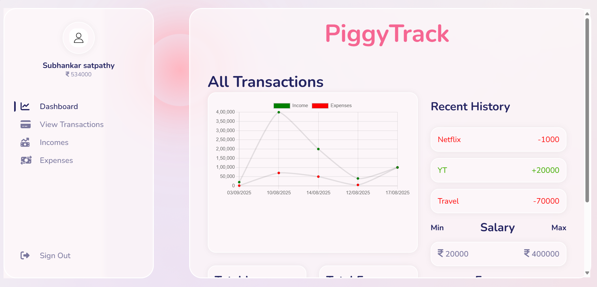
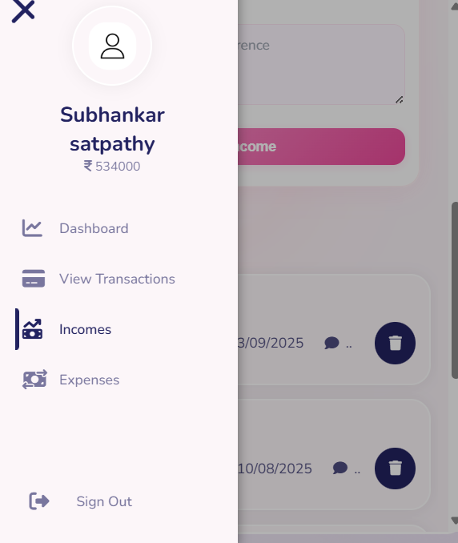
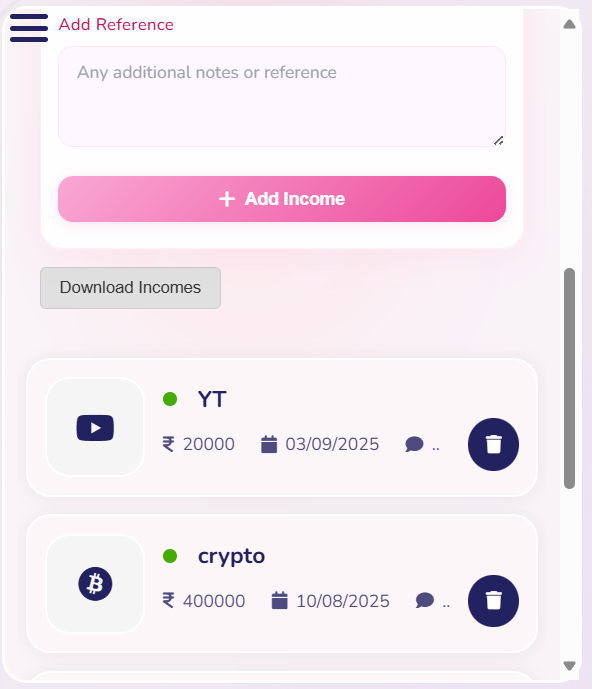
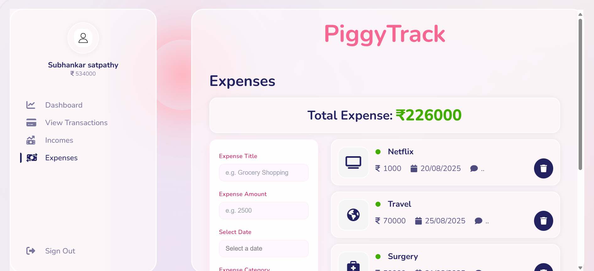
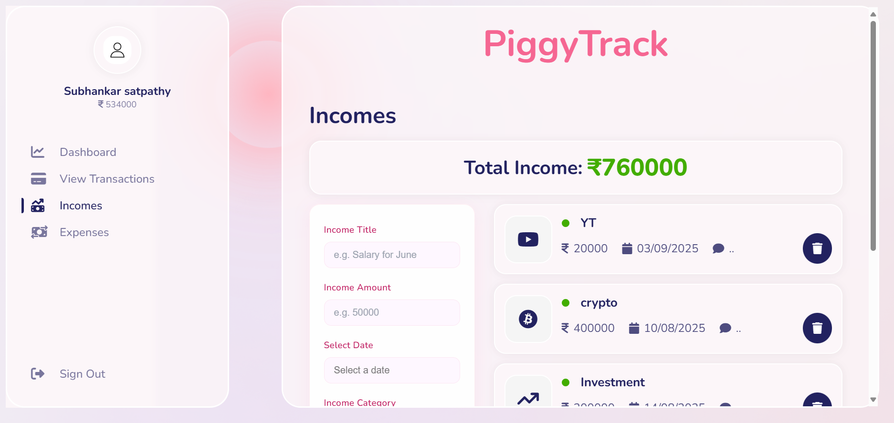
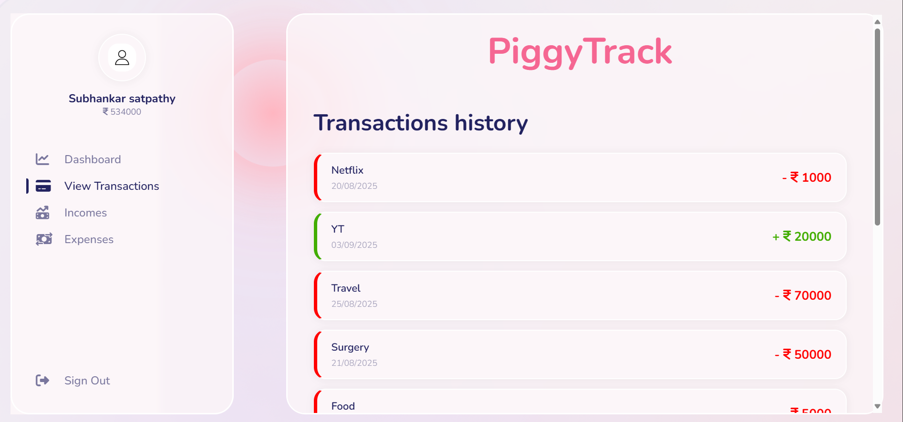

PiggyTrack – Personal Finance Dashboard

PiggyTrack is a full‑stack personal finance tracker built with the MERN stack. It lets users add incomes and expenses, view trends, and understand monthly balance with a clean, responsive UI. It’s designed to be fast, privacy‑friendly, and easy to extend.

🚀 Live Links
(https://piggytrack-vbyp.onrender.com)

✨ Features

Authentication with JWT (signup/login)

Add, view, and delete incomes and expenses

Dashboard with totals (income, expense, balance)

Recent transactions widget

Interactive line chart (income vs expense)

Combined transactions timeline

Export data to Excel (XLSX)

Responsive design with mobile drawer navigation

Accessible, consistent forms (labels, validation, styled date picker)

🛠 Tech Stack

Frontend: React 18, Context API, styled-components, react-chartjs-2, chart.js, react-datepicker

Backend: Node.js, Express, JWT (jsonwebtoken), bcryptjs

Database: MongoDB (Mongoose)

Utilities: Axios, XLSX (SheetJS), file-saver

Deployment: Render

Screenshots

🛣️ Roadmap

Budgets with progress and alerts

Category analytics (pie/donut; top categories)

Pagination and advanced filters (date range, category)

Recurring transactions

Multi-currency support

Swagger/OpenAPI docs

Test suite (Jest + supertest, Cypress)

Rate limiting for auth, helmet for security headers

